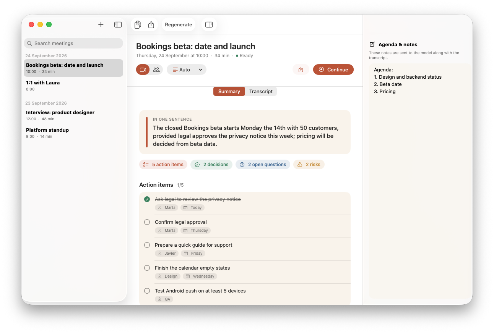
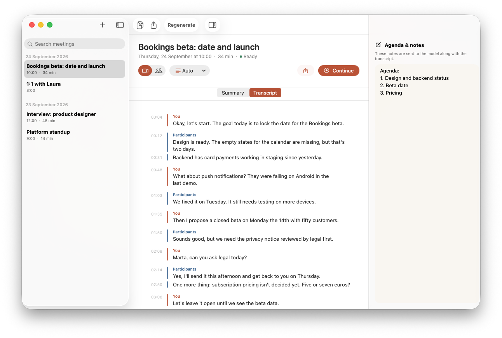
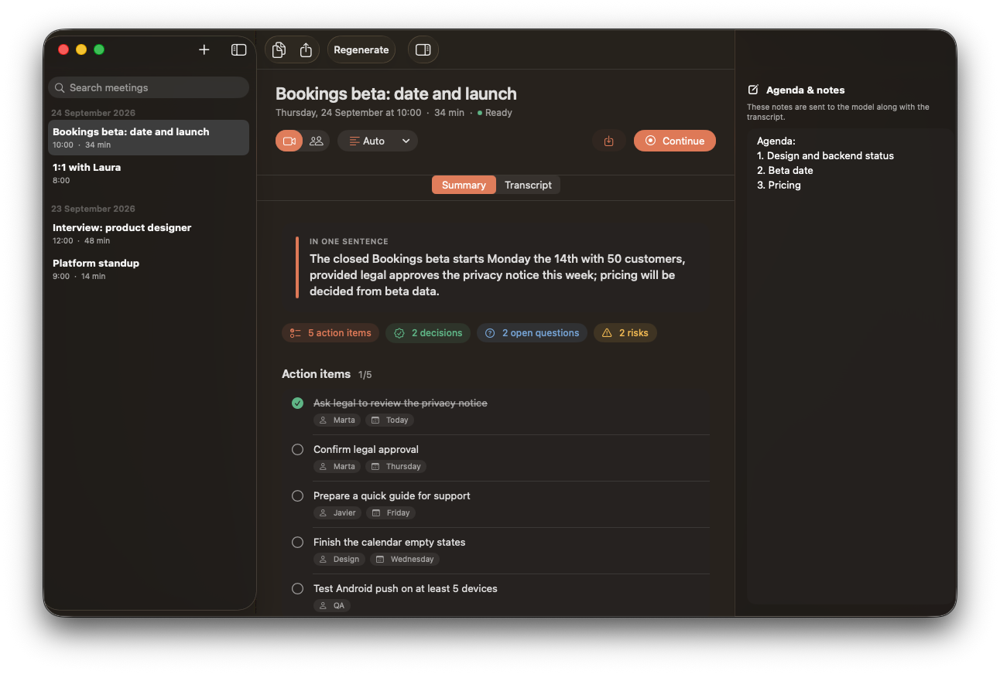
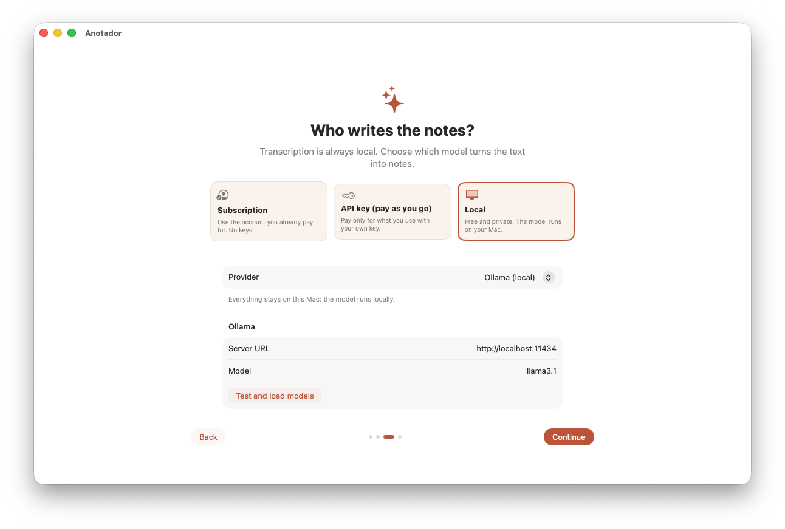

<p align="center">
  
</p>

<h1 align="center">Anotador</h1>

<p align="center">
  Meeting notes for the Mac where nothing slips through the cracks.<br>
  Transcribes on your Mac and writes down decisions, action items and open questions with the model you choose.
</p>

<p align="center">
  <a href="https://github.com/AlejandroTejedo/Anotador/actions/workflows/ci.yml"></a>
  
  
  <a href="LICENSE"></a>
</p>

<p align="center">
  <a href="README.md">Español</a> · <b>English</b>
</p>

<p align="center">
  
</p>

## What it does

- **Records the meeting**: your microphone and, for virtual meetings, system audio (Zoom, Google Meet, Teams, FaceTime). You can also upload a recording.
- **Transcribes on your Mac** with Apple's SpeechAnalyzer. Your voice shows up as *You* and everyone else as *Participants*, because they're captured on separate channels.
- **Writes notes you can act on**: one-sentence recap, key points with quote and timestamp, decisions, action items with owner and due date, open questions, risks and next steps.
- **You pick the model**: your subscription, your API key, or a free local model.
- **Action items as a checklist**, timestamps that jump to the transcript, and Markdown export.
- In English and Spanish, light and dark mode.

| | |
|---|---|
|  |  |
| Transcript split by speaker | Dark mode |

## Privacy

| What | Where it stays |
|---|---|
| Audio | On your Mac: `~/Library/Application Support/Anotador/Meetings/`. Deleted with the meeting. |
| Transcript | On your Mac, always. SpeechAnalyzer works offline. |
| Notes | The transcript **text** and your notes go to the provider you choose. With Ollama or LM Studio nothing leaves your Mac. |
| API keys | In the macOS Keychain, never in plain text. |

Anotador has no server, accounts or analytics.

Before each recording it asks you to confirm that others know. **Always tell the people in the meeting** and follow your local laws on recording conversations.

## Models



| Provider | Type | What you need |
|---|---|---|
| Grok (CLI) | Subscription | [Grok CLI](https://x.ai) with `grok login` |
| ChatGPT | API key | Key from [platform.openai.com](https://platform.openai.com/api-keys) |
| Grok (xAI) | API key | Key from [console.x.ai](https://console.x.ai) |
| Claude | API key | Key from [console.anthropic.com](https://console.anthropic.com/settings/keys) |
| Ollama | Local, free | [Ollama](https://ollama.com) and a model (`ollama pull llama3.1`) |
| LM Studio | Local, free | [LM Studio](https://lmstudio.ai) with the local server running |
| OpenAI-compatible | Local or remote | A `/v1` base URL (vLLM, llama.cpp, OpenRouter…) |

Set it up in the welcome guide or in **Settings → Model**. **Test and load models** checks the key and lists the models available to you.

With local models, pick one with a large context for long meetings. Anotador sizes Ollama's `num_ctx` to the transcript.

<br clear="right">

## Requirements

- macOS 26 or later on Apple Silicon
- Microphone and Speech Recognition permissions, plus Screen Recording for virtual meetings (only the audio is used; no video is recorded)

## Install

There's no downloadable build yet, so for now you build it from source.

```bash
git clone https://github.com/AlejandroTejedo/Anotador.git
cd Anotador
open Anotador.xcodeproj
```

Press ⌘R in Xcode 26. Out of the box the app is signed to run locally. To sign with your own Apple account, see [Signing](CONTRIBUTING.md#firma).

## Usage

1. **⌘N** creates a meeting. Choose **Virtual meeting** (microphone + system audio) or **In person** (microphone only).
2. **⌘⇧M** starts transcribing. Write the agenda or notes in the right-hand panel: the model will use them.
3. **⌘⇧.** stops and writes the notes.
4. Tick off action items, copy or export to Markdown.

The menu bar icon shows the recording in progress, audio levels and recent meetings.

## Contributing

Contributions are welcome. See [CONTRIBUTING.md](CONTRIBUTING.md) (in Spanish; issues and PRs in English are fine too). To report a security issue, see [SECURITY.md](SECURITY.md).

## License

[MIT](LICENSE) © 2026 Alejandro Tejedo.

Anotador doesn't ship any models or keys. Each provider's own terms apply.
