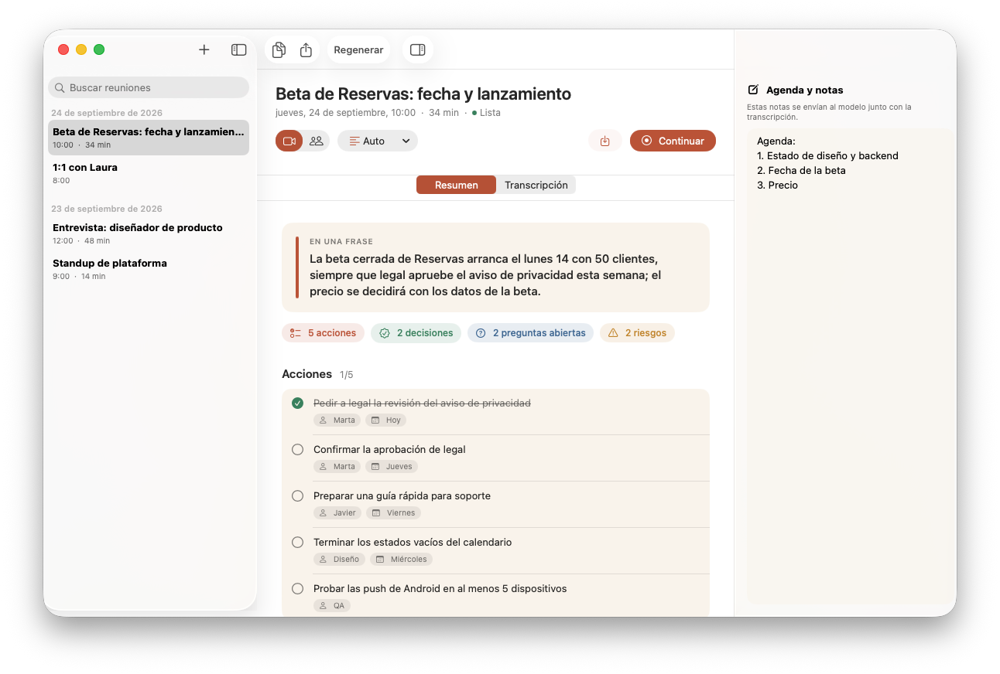
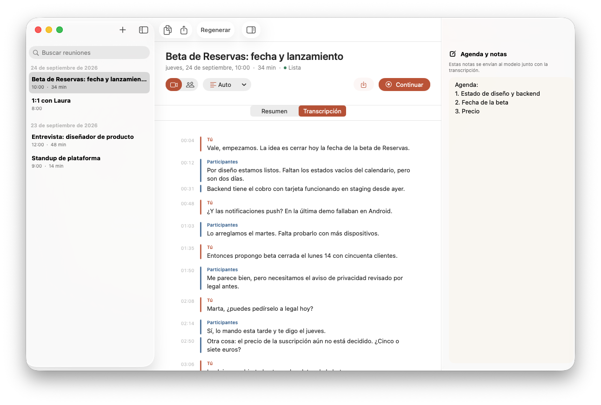
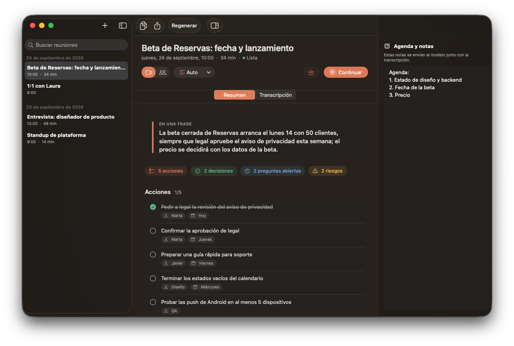
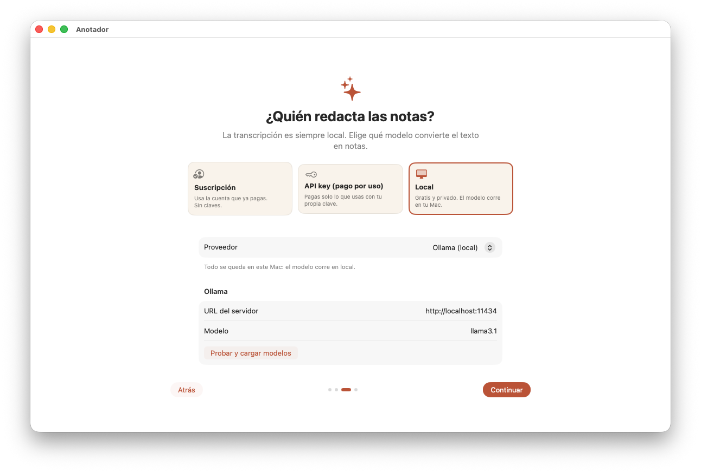

<p align="center">
  
</p>

<h1 align="center">Anotador</h1>

<p align="center">
  Notas de reunión para Mac que no dejan nada en el aire.<br>
  Transcribe en tu Mac y deja por escrito decisiones, acciones y dudas con el modelo que tú elijas.
</p>

<p align="center">
  <a href="https://github.com/AlejandroTejedo/Anotador/actions/workflows/ci.yml"></a>
  
  
  <a href="LICENSE"></a>
</p>

<p align="center">
  <b>Español</b> · <a href="README.en.md">English</a>
</p>

<p align="center">
  
</p>

## Qué hace

- **Graba la reunión**: tu micrófono y, en reuniones virtuales, el audio del sistema (Zoom, Google Meet, Teams, FaceTime). También puedes subir una grabación.
- **Transcribe en tu Mac** con SpeechAnalyzer de Apple. Tu voz aparece como *Tú* y el resto como *Participantes*, porque van por canales distintos.
- **Redacta notas que se pueden usar**: frase resumen, puntos clave con cita y minuto, decisiones, acciones con responsable y fecha, preguntas abiertas, riesgos y próximos pasos.
- **Tú eliges el modelo**: tu suscripción, tu API key o un modelo local y gratuito.
- **Acciones como checklist**, marcas de tiempo que saltan a la transcripción y exportación a Markdown.
- En español e inglés, con modo claro y oscuro.

| | |
|---|---|
|  |  |
| Transcripción separada por interlocutor | Modo oscuro |

## Privacidad

| Qué | Dónde se queda |
|---|---|
| Audio | En tu Mac: `~/Library/Application Support/Anotador/Meetings/`. Se borra al borrar la reunión. |
| Transcripción | En tu Mac, siempre. SpeechAnalyzer funciona sin conexión. |
| Notas | El **texto** de la transcripción y tus notas van al proveedor que elijas. Con Ollama o LM Studio no sale nada del Mac. |
| API keys | En el Llavero de macOS, nunca en texto plano. |

Anotador no tiene servidor, cuentas ni analítica.

Antes de cada grabación te pide confirmar que los demás lo saben. **Avisa siempre a las personas de la reunión** y respeta las leyes de tu país sobre grabación de conversaciones.

## Modelos



| Proveedor | Tipo | Qué necesitas |
|---|---|---|
| Grok (CLI) | Suscripción | [Grok CLI](https://x.ai) con `grok login` |
| ChatGPT | API key | Key de [platform.openai.com](https://platform.openai.com/api-keys) |
| Grok (xAI) | API key | Key de [console.x.ai](https://console.x.ai) |
| Claude | API key | Key de [console.anthropic.com](https://console.anthropic.com/settings/keys) |
| Ollama | Local, gratis | [Ollama](https://ollama.com) y un modelo (`ollama pull llama3.1`) |
| LM Studio | Local, gratis | [LM Studio](https://lmstudio.ai) con el servidor local activo |
| Compatible con OpenAI | Local o remoto | URL base `/v1` (vLLM, llama.cpp, OpenRouter…) |

Se configura en la bienvenida o en **Ajustes → Modelo**. **Probar y cargar modelos** valida la key y lista los modelos disponibles.

Con modelos locales, usa uno con contexto amplio para reuniones largas. Anotador ajusta `num_ctx` de Ollama según la longitud de la transcripción.

<br clear="right">

## Requisitos

- macOS 26 o posterior, Mac con Apple Silicon
- Permisos de micrófono y reconocimiento de voz, más grabación de pantalla para reuniones virtuales (solo se usa el audio; no se graba vídeo)

## Instalación

Todavía no hay versión descargable: por ahora se compila desde el código.

```bash
git clone https://github.com/AlejandroTejedo/Anotador.git
cd Anotador
open Anotador.xcodeproj
```

Pulsa ⌘R en Xcode 26. Sin configurar nada, la app se firma para ejecutarse en local. Si quieres firmarla con tu cuenta de Apple, mira [Firma](CONTRIBUTING.md#firma).

## Uso

1. **⌘N** crea una reunión. Elige **Reunión virtual** (micrófono y audio del sistema) o **Presencial** (solo micrófono).
2. **⌘⇧M** empieza a transcribir. Puedes escribir la agenda o notas en el panel derecho: el modelo las tendrá en cuenta.
3. **⌘⇧.** detiene la grabación y redacta las notas.
4. Marca las acciones hechas, copia o exporta a Markdown.

El icono de la barra de menús muestra la grabación en curso, los niveles de audio y las reuniones recientes.

## Colaborar

Las contribuciones son bienvenidas. Lee [CONTRIBUTING.md](CONTRIBUTING.md) para compilar, pasar los tests, añadir un proveedor o traducir. Para avisar de un problema de seguridad, mira [SECURITY.md](SECURITY.md).

## Licencia

[MIT](LICENSE) © 2026 Alejandro Tejedo.

Anotador no incluye modelos ni claves. El uso de cada proveedor se rige por sus propios términos.
